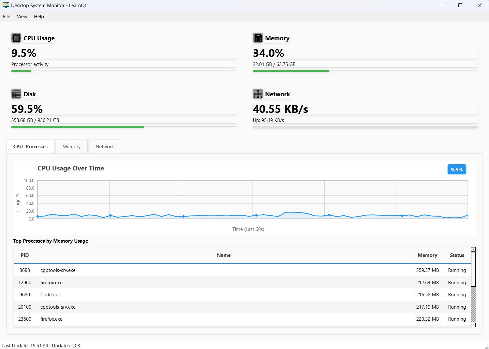

# System Monitor - A Qt Widgets & C++ Learning Journey



## Overview

This repository contains the complete source code Qt Desktop Applications: Building Real Software with Modern {cpp}. A book that takes you through seven complete iterations, each building upon the last to create production-quality desktop software - a real-time System Monitor application.

**What you'll monitor:**
- Real-time CPU usage with historical graphs
- Memory statistics and visualization
- Disk space availability
- Network activity tracking
- Live process table with detailed information

**Platforms supported:**
- Windows (using PDH, PSAPI, IP Helper API)
- Linux (using `/proc` filesystem)

## What Makes This Project Special

This isn't a toy tutorial. You're building real software with:

- **Live data visualization** - Smooth 60-second scrolling charts
- **Cross-platform architecture** - Clean separation between platform-specific code
- **Custom-painted widgets** - Full control using `QPainter`
- **Theme support** - Automatic light/dark mode detection
- **Professional UI** - Polished layouts, menus, shortcuts, and status bars
- **Real system metrics** - Actual data from OS APIs, updated every second

## Project Structure

The repository is organized into seven iterations, each representing a complete, working application:

```
iteration01/    - Basic Qt project setup and empty window
iteration02/    - Platform-specific system information gathering
iteration03/    - SystemMonitor orchestrator with signals and slots
iteration04/    - Custom InfoCard widgets for metrics display
iteration05/    - ChartWidget for real-time data visualization
iteration06/    - ProcessTableWidget for running processes
iteration07/    - Final polish with menus, themes, and integration
```

Each iteration can be built and run independently, allowing you to see the progression of the application.

## Technology Stack

- **Qt 6** - Cross-platform GUI framework
- **C++17** - Modern C++ with standard library features
- **CMake** - Build system configuration
- **Platform APIs:**
  - Windows: PDH, PSAPI, IP Helper, Tool Help
  - Linux: `/proc` filesystem

## Prerequisites

### Required Software

- **Qt 6.2 or later** - [Download from Qt.io](https://www.qt.io/download)
- **CMake 3.16 or later** - Comes with Qt installation or [Download from cmake.org](https://cmake.org/download/) 
- **C++ Compiler:**
  - Windows: MSVC 2019 or later, or MinGW
  - Linux: GCC 7.0+ or Clang 5.0+

### Qt Modules Used

- Qt6::Core
- Qt6::Widgets
- Qt6::Gui

## Building the Project

### Using Qt Creator

1. Open Qt Creator
2. File → Open File or Project
3. Select the `CMakeLists.txt` from any iteration folder
4. Configure the project with your Qt kit
5. Build and run (Ctrl+R / Cmd+R)

## What You'll Learn

### Architecture & Design
- Three-layer architecture for maintainable code
- Cross-platform development patterns
- Separation of concerns and loose coupling
- Event-driven programming with signals and slots

### Qt Framework
- Qt Widgets fundamentals
- Custom widget development
- QPainter for custom rendering
- Qt's layout system
- Signal and slot mechanism
- Theme-aware UI design

### System Programming
- Windows Performance Data Helper (PDH) API
- Windows Process Status API (PSAPI)
- Linux `/proc` filesystem navigation
- CPU usage calculation algorithms
- Memory statistics gathering
- Network traffic monitoring
- Process enumeration and management

### C++ Best Practices
- Modern C++17 features
- RAII and resource management
- Platform abstraction techniques
- Header-only utilities
- Const correctness
- Smart pointers (where applicable)

## The Seven Iterations

### Iteration 1: Foundation
Create the basic Qt project structure and understand what Qt Creator generates. You'll have a working empty window.

### Iteration 2: System Information
Implement platform-specific code to gather CPU, memory, disk, and network statistics. Learn to abstract platform differences.

### Iteration 3: SystemMonitor Class
Build the orchestrator that coordinates data collection and event distribution using Qt's signals and slots.

### Iteration 4: InfoCard Widgets
Create reusable card widgets to display metrics in a clean, modern interface.

### Iteration 5: Chart Visualization
Implement custom-painted scrolling charts for real-time data visualization.

### Iteration 6: Process Table
Add a comprehensive process table showing all running applications with filtering and sorting.

### Iteration 7: Final Integration
Polish the application with menus, keyboard shortcuts, tabbed layouts, status bars, and theme support.

## Key Features by Iteration

| Feature | Iteration |
|---------|-----------|
| Empty Qt Window | 1 |
| Platform-specific system info | 2 |
| Signal/slot architecture | 3 |
| InfoCard widgets | 4 |
| Real-time charts | 5 |
| Process table | 6 |
| Menus & themes | 7 |

## Code Organization

```
iteration0X/
├── CMakeLists.txt          # Build configuration
├── main.cpp                # Application entry point
├── mainwindow.h/cpp        # Main window container
├── mainwindow.ui           # UI layout (Qt Designer file)
├── systemmonitor.h/cpp     # Data orchestrator
├── utils/                  # Utility functions
│   ├── formatters.h        # String formatting helpers
│   ├── systeminfo.h        # Platform abstraction layer
│   ├── systeminfo_win.cpp  # Windows implementation
│   ├── systeminfo_linux.cpp # Linux implementation
│   └── theme.h             # Theme detection (iteration 7)
├── widgets/                # Custom widgets
│   ├── infocard.h/cpp      # Metric display cards
│   ├── chartwidget.h/cpp   # Scrolling charts
│   └── processtablewidget.h/cpp # Process table
└── resources/              # Icons and assets
```

## Cross-Platform Notes

### Windows Specific
- Links against `pdh.lib`, `psapi.lib`, `iphlpapi.lib`
- Uses Windows Performance Counters for CPU metrics
- Requires Windows 7 or later

### Linux Specific
- Reads from `/proc/stat`, `/proc/meminfo`, `/proc/net/dev`
- Process information from `/proc/[pid]/` directories
- Tested on Ubuntu 20.04+ and Fedora 35+

## Contributing

This is educational code accompanying a book. Feel free to experiment and modify as you learn, but note that this repository is structured to match the book's progression.

## Acknowledgments

Built with:
- [Qt Framework](https://www.qt.io/)
- Modern C++ standards
- Love for system-level programming

## Questions or Issues?

Each iteration is designed to be self-contained and buildable. If you encounter issues:
1. Verify your Qt installation is complete
2. Review the CMakeLists.txt for platform-specific requirements

---

**Ready to build something real?** Start with `iteration01` and work your way through. By the end, you'll have a production-quality system monitor and the skills to build any desktop application you can imagine.
